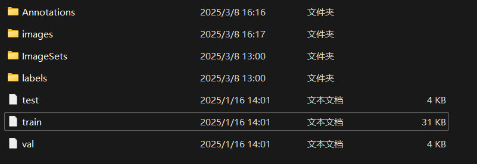
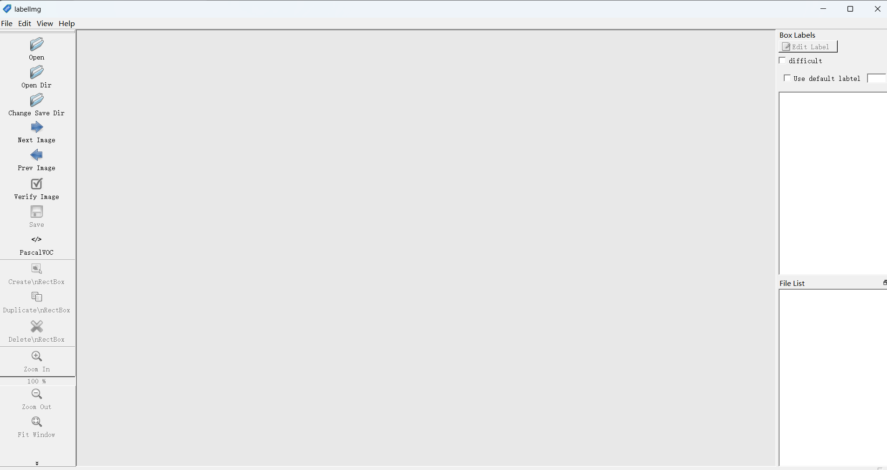

# YOLOv8_fast_running
## A simple introduction about YOLOv8_fast_running
This project is mainly about getting started with yolov8 code quickly,  <br>
which can help you run yolov8 quickly and implement yolo with only a few steps. <br>
However, for the logic and details of the source code, please check the official code for yourself.


## Details
you can git my code in FY-4/YOLOv8_fast_running<br>
I will tell the steps and use gpu to promote the process by the plateform named Autodl

## Structure
>YOLOv8_Finally

>>my_data
>>>images<br>
>>>Annotations<br>
>>>ImageSets<br>
>>>labels<br>

>>1.yaml<br>
>>train.py<br>
>>voc_label.py<br>
>>split_train_val.py<br>

>README.md<br>

## Steps

#### As you open the YOLOv8_fast_running<br>
```Bash
cd YOLOv8_fast_running
```
#### YOLOv8_fast_running/my_data is your datasets
when you finish your dataset<br>
```Bash
python split_train_val.py
python voc_label.py
```

#### As you finish to reset your 1.yaml file
```Bash
python train.py
```
#### Then if you step into process of trainning model , you can take a relax and wait for a moment which dependent on your trainning times.

## Some details
>my_data
>>images<br>
>>Annotations<br>
>>ImageSets<br>
>>labels<br>

this is the structure of your datasets<br>*images* contains all of your original photos<br>
<br>
```python
python pictures.py
```
so that you can get whole datasets just by tap 'q' And the details concerning the comprehensive code waitting for you to search for<br>
<br>
the Annotations contain all the .xml files which is dealt by labellmg so we can put the xml file in this directory<br>

if you want to use this tool , just git clone labellmg_master<br>
<br>
ImageSets and labels do not request you to do something just run<br>
```Bash
python split_train_val.py
python voc_label.py
```
In split_train_val.py
```python
trainval_percent = 0.95
train_percent = 0.95
xmlfilepath = 'my_data_1/Annotations'
txtsavepath = 'my_data_1/ImageSets'
total_xml = os.listdir(xmlfilepath)

num = len(total_xml)
list = range(num)
tv = int(num * trainval_percent)
tr = int(tv * train_percent)
trainval = random.sample(list, tv)
train = random.sample(trainval, tr)

ftrainval = open('my_data_1/ImageSets/trainval.txt', 'w')
ftest = open('my_data_1/ImageSets/test.txt', 'w')
ftrain = open('my_data_1/ImageSets/train.txt', 'w')
fval = open('my_data_1/ImageSets/val.txt', 'w')
```
trainval_percent and train_percent are the nums of trainval_percent in whole datasets 95%<br>
you must transfer the loading_file path to your own path because it is the relative path<br>
<br>
In voc_label.py
```python
sets = ['train', 'val', 'test']
classes = ['CYLJ', 'KHSLJ', 'QTLJ', 'YHLJ']#111111111111111111111111111
```
you must transfer the classes to your own classes, such as you make a dataset concerning person ,you can change the classes=["person"]<br>
<br>

